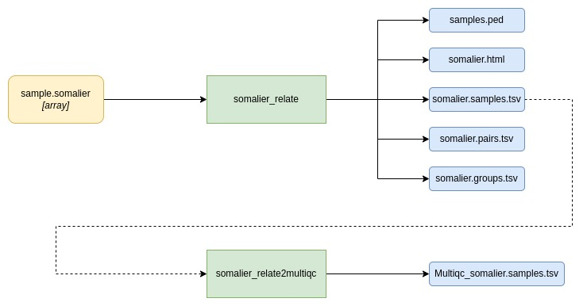

# eggd_somalier_workflow

DNAnexus somalier workflow applicable to any pipeline which has somalier
output files from [somalier_extract](https://github.com/eastgenomics/eggd_somalier_extract). The outputs of this workflow
can be inputted into the multiQC app.

-------

## Current Version: 1.1.0

## What are the limitations of this workflow?

The x_het call threshold to predict female sex phenotype is currently set to
70 which is the case where all SNPs of X chromosome (required for somalier to extract) are present. If this
is not the case, then this threshold should be amended appropriately
to the number of SNP probes present for the assay.

## What apps are used in this workflow?

|  App 	| Version  	|
|---	|---	|
|somalier_relate       |1.1.0|
|somalier_relate2multiqc   |1.0.1|